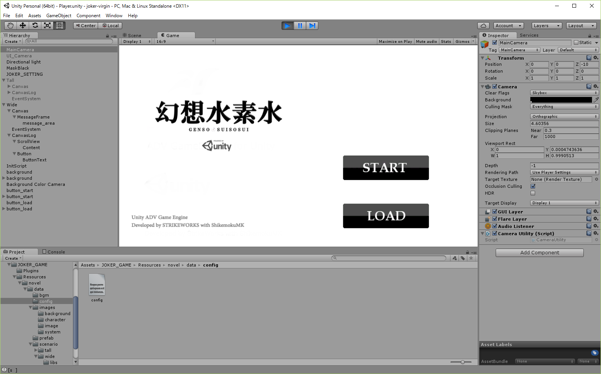

# genso-suisosui

## What's this?
- [Suikoden](https://www.konami.com/games/eu/en/products/suiko/)'s joke title logo
    - in Japanese **幻想水滸伝** as `Suikoden`
    - character is **Japanese Kanji (Chinese character)**
    - based on [Suikoden Series Portal Web Site (Japanese)](http://www.konami.jp/gs/game/genso/)
- included one psd and two pngs
    - psd
        - integrated layers
    - png (logo image ver.)
        - source is integrated layers psd
        - transparent
    - png (in Unity ver.)
        - What game is this? :)

## Scrrenshot
- png (in Unity ver.)

## Quality
- Very low :-)

## License
- [MIT License](/LICENSE)
